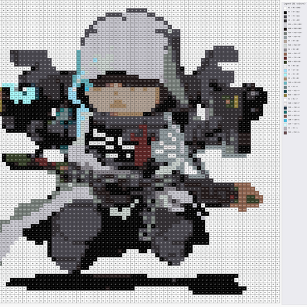

<div align="center">



# BeadStudio 豆趣工坊

**Create Any Blueprint within Reach · 一切图纸，触手可及**

**图片 → 拼豆图纸 · 本地离线 · Windows 桌面应用**

**Image → bead pattern design, fully offline, Windows desktop app**

`v1.0.0` · [GPL-3.0](LICENSE) · PySide6

</div>

---

## 目录 / Table of Contents

1. [简介 / Introduction](#简介--introduction)
2. [特性 / Features](#特性--features)
3. [截图 / Screenshots](#截图--screenshots)
4. [下载 / Download](#下载--download)
5. [安装（源码运行）/ Installation (from source)](#安装源码运行--installation-from-source)
6. [使用 / Usage](#使用--usage)
7. [背景移除 / Background Removal](#背景移除--background-removal)
8. [构建 exe / Build exe](#构建-exe--build-exe)
9. [测试 / Tests](#测试--tests)
10. [许可 / License](#许可--license)
11. [致谢 / Acknowledgements](#致谢--acknowledgements)
12. [开发 / Dev Notes](#开发--dev-notes)

---

## 简介 / Introduction

**中文**

BeadStudio（豆趣工坊）是一款纯本地运行的拼豆图纸设计桌面应用。选一张图片，
自动匹配最接近的拼豆品牌色号，生成可预览、可导出的拼豆图纸 —— 支持 PDF
图纸（带色号标注与图例）、购物清单 CSV、图案 PNG，以及整目录批量转换与
可选的一键背景移除。无需联网，所有色板数据均随应用打包。

**English**

BeadStudio (豆趣工坊) is a fully offline desktop app for designing bead
(perler/hama) patterns. Pick an image and it matches the nearest bead color
codes of your chosen brand, producing a preview and exports: PDF
patterns (with codes and legend), shopping-list CSV, pattern PNG, plus
whole-folder batch conversion and optional one-click background removal. No
network needed — all palette data ships with the app.

---

## 特性 / Features

| 功能 / Feature | 说明 / Description |
| --- | --- |
| 图片 → 拼豆图纸 / Image → pattern | 任意图片缩放为指定珠数网格，逐格匹配最接近的拼豆色号 |
| 品牌色号匹配 / Brand matching | 内置 **21 个品牌、3706 种色号**（Perler / Hama / Artkal / 国产豆等） |
| CIEDE2000 色差 / CIEDE2000 | 感知均匀的色差算法（默认），观感更接近原图；亦支持 OKLab 快速匹配 |
| 手动生成预览 / Generate preview | 点"生成预览"按钮出图，参数可反复调整，不会自动重算卡顿 |
| PDF 图纸导出 / PDF export | 带网格、色号标注与图例页的 A4 PDF |
| 购物清单 CSV / Shopping CSV | 按色号汇总的采购清单，含拼装耗时与费用估算 |
| PNG 图案导出 / PNG export | 高清图案预览图 |
| 批量转换 / Batch | 一键处理整个目录下的图片 |
| 背景移除 / Bg-remove | 可选依赖（rembg），一键自动抠图 |
| 中英双语 / Bilingual | 手动切换（右上角语言下拉）或跟随系统 locale |
| 本地离线 / Offline | 无任何联网请求，色板数据随包分发 |

---

## 截图 / Screenshots

**中文**：主窗口（带拼豆图案预览）与空状态界面。以下均为应用真实渲染的截图
（深色主题）。

**English**：Main window (with a rendered bead pattern preview) and the empty
state. Both are real renders of the app (dark theme).


---

## 下载 / Download

**中文**：Windows 免安装版 `BeadStudio.exe`（PyInstaller onefile，约 89 MB，
无需 Python 环境）从 **GitHub Releases** 下载：

**English**：Portable Windows build `BeadStudio.exe` (PyInstaller onefile,
~89 MB, no Python required) is available from **GitHub Releases**:

> https://github.com/Chen-Y-Dan/Bead-Studio/releases

下载后直接双击运行即可。After download, double-click to run.

---

## 安装（源码运行）/ Installation (from source)

要求 Python ≥ 3.10，推荐 3.11。

**中文**

```bash
# 1. 创建虚拟环境（示例：conda）
conda create -n beadGUI python=3.11
conda activate beadGUI

# 2. 安装依赖
pip install PySide6 Pillow numpy colour-science reportlab typer

# 3. 以可编辑模式安装项目（开发）
pip install -e .
```

**English**

```bash
# 1. Create a virtual environment (example: conda)
conda create -n beadGUI python=3.11
conda activate beadGUI

# 2. Install dependencies
pip install PySide6 Pillow numpy colour-science reportlab typer

# 3. Install the project in editable mode (development)
pip install -e .
```

---

## 使用 / Usage

**中文** — **图形界面（GUI）**

1. 启动：`conda run -n beadGUI python -m beadstudio`（或双击 BeadStudio.exe）
2. **载入图片**：点"选择图片"，或直接**拖拽图片**到窗口，或按 **Ctrl+V** 粘贴
3. 设置**品牌**（如 Perler）、**宽度**（珠数，高度留 0 自动保持比例）、
   **系列**（如需要）
4. 点**"生成预览"**出图；可开关网格 / 色号显示、调整格子大小
5. 勾选 **导出 PDF / PNG / CSV**（购物清单）→ 点生成预览时一并写入输出目录

**命令行（CLI）**：引擎保留命令行入口，可与 GUI 互换使用：

```bash
conda run -n beadGUI python -m beadstudio.core.cli convert photo.png --brand perler --width 52 --pdf --shopping-list
conda run -n beadGUI python -m beadstudio.core.cli list-brands
```

更多选项见 `--help`。

**English** — **GUI**

1. Launch: `conda run -n beadGUI python -m beadstudio` (or double-click
   BeadStudio.exe)
2. **Load an image**: click Choose image, or **drag & drop** it onto the
   window, or press **Ctrl+V** to paste
3. Set **brand** (e.g. Perler), **width** in beads (leave height 0 for
   auto-ratio), **series** if needed
4. Click **Generate Preview** to render; toggle grid / codes / zoom
5. Check **Export PDF / PNG / CSV** (shopping list) → written to the output
   dir when the preview is generated

**CLI**: the engine keeps its command-line entry, usable interchangeably:

```bash
conda run -n beadGUI python -m beadstudio.core.cli convert photo.png --brand perler --width 52 --pdf --shopping-list
conda run -n beadGUI python -m beadstudio.core.cli list-brands
```

See `--help` for all options.

---

## 背景移除 / Background Removal

**中文**：背景移除为**可选功能**，需要额外安装 `rembg` 与 `onnxruntime`：

```bash
conda run -n beadGUI pip install rembg onnxruntime
```

未安装时，界面中的"背景移除"选项会自动禁用，转换照常进行（背景移除被跳过）。

**English**: Background removal is **optional** — install `rembg` and
`onnxruntime`:

```bash
conda run -n beadGUI pip install rembg onnxruntime
```

Without them the "Remove background" option is auto-disabled and conversion
proceeds normally (bg-removal skipped).

---

## 构建 exe / Build exe

**中文**：在 Windows + 已安装 PyInstaller 的环境中运行：

```powershell
powershell -ExecutionPolicy Bypass -File scripts\build_exe.ps1
```

产物：`dist\BeadStudio.exe`（onefile、无控制台窗口、带应用图标）。验证：

```powershell
dist\BeadStudio.exe --list-brands   # 期望输出：list-brands=21
```

**English**: On Windows with PyInstaller installed:

```powershell
powershell -ExecutionPolicy Bypass -File scripts\build_exe.ps1
```

Output: `dist\BeadStudio.exe` (onefile, windowed, app icon). Verify:

```powershell
dist\BeadStudio.exe --list-brands   # expect: list-brands=21
```

> 注意：`dist/`、`build/`、`*.spec` 为构建产物，已被 .gitignore 排除，
> 不会进入版本库。Note: `dist/`, `build/`, `*.spec` are build artifacts,
> excluded by .gitignore, never committed.

---

## 测试 / Tests

```bash
conda run -n beadGUI python -m pytest tests/ -q
```

51 个测试全部通过（冒烟 + 界面 + 导出 + 国际化 + 拖拽粘贴 + 主题）。51 tests
pass (smoke + UI + exports + i18n + drag/paste + theme).

---

## 许可 / License

**中文**：本项目以 **GNU General Public License v3.0**（GPL-3.0）开源，详见
[LICENSE](LICENSE)。第三方组件的署名与许可说明见 [NOTICE](NOTICE)：
引擎核心改编自 bead-pattern-cli（MIT）、色板数据来自 beadcolors（MIT）与
pindou-color-data（Apache-2.0）、界面基于 Qt/PySide6（LGPL-3.0/GPL-3.0 双许可）。

**English**: This project is open-source under the **GNU General Public
License v3.0** — see [LICENSE](LICENSE). Third-party attributions are in
[NOTICE](NOTICE): the engine core is adapted from bead-pattern-cli (MIT),
palette data comes from beadcolors (MIT) and pindou-color-data (Apache-2.0),
and the UI is built on Qt/PySide6 (LGPL-3.0/GPL-3.0 dual license).

---

## 致谢 / Acknowledgements

**中文**：感谢以下开源项目 —— 没有它们就没有 BeadStudio：

- [bead-pattern-cli / pindou](https://github.com/HansBug/pypindou)（MIT）—
  引擎核心改编来源（源项目为本地开发的拼豆转换引擎）
- [beadcolors](https://github.com/maxcleme/beadcolors)（MIT，maxcleme）—
  15 个品牌的色板数据
- [pindou-color-data](https://github.com/HansBug/pindou-color-data)
  （Apache-2.0，HansBug）— 6 个品牌的色板数据
- [Qt for Python / PySide6](https://doc.qt.io/qtforpython/) — GUI 框架

**English**: Thanks to the following open-source projects — BeadStudio
would not exist without them:

- [bead-pattern-cli / pindou](https://github.com/HansBug/pypindou) (MIT) —
  source of the adapted engine core (a locally-developed bead engine)
- [beadcolors](https://github.com/maxcleme/beadcolors) (MIT, maxcleme) —
  palette data for 15 brands
- [pindou-color-data](https://github.com/HansBug/pindou-color-data)
  (Apache-2.0, HansBug) — palette data for 6 brands
- [Qt for Python / PySide6](https://doc.qt.io/qtforpython/) — GUI framework

---

## 开发 / Dev Notes

**中文**

- **环境**：conda 环境 `beadGUI`（Python 3.11），依赖见 `pyproject.toml`。
- **i18n 约定**：所有面向用户的 UI 字符串必须通过 `beadstudio/ui/i18n.py`
  的 `tr()` 走双语字典（(English, Chinese) 二元组），禁止硬编码界面文案；
  语言默认跟随系统 locale，也可在右上角下拉手动切换（中 / EN）。
- **目录结构**：

  ```
  beadstudio/
  ├── app.py            # QApplication + 主窗口
  ├── ui/               # 界面：i18n.py / preview.py / settings_panel.py
  ├── core/             # 引擎（bead-pattern-cli 的拷贝，见 AGENTS.md 拷贝规则）
  │   ├── cli.py        # 命令行入口
  │   ├── convert.py    # 图片 → 拼豆网格管线
  │   ├── palette.py    # 色板加载（core/data/palettes/*.json）
  │   ├── estimate.py   # 耗时/费用估算
  │   └── export.py     # PNG / CSV / PDF 导出
  ├── assets/           # app_icon.ico / app_icon_512.png
  ├── tests/            # pytest（51 个）
  └── scripts/build_exe.ps1  # PyInstaller 构建脚本
  ```

- **拷贝规则**：`beadstudio/core/` 是 bead-pattern-cli 引擎的拷贝，只允许
  从上游单向同步，不得在本地私自分叉；改动前先同步上游。

**English**

- **Environment**: conda env `beadGUI` (Python 3.11); deps in
  `pyproject.toml`.
- **i18n convention**: every user-facing UI string must go through `tr()`
  in `beadstudio/ui/i18n.py` (a (English, Chinese) tuple dictionary) — no
  hardcoded UI text; language follows the system locale by default and can
  be switched manually via the top-right dropdown (中 / EN).
- **Layout**: see the tree above.
- **Copy rule**: `beadstudio/core/` is a copy of the bead-pattern-cli
  engine — sync one-way from upstream only, never fork locally; sync before
  modifying (see AGENTS.md).

---

<div align="center">

**BeadStudio 豆趣工坊** · Copyright (C) 2026 BeadStudio contributors · GPL-3.0

</div>
